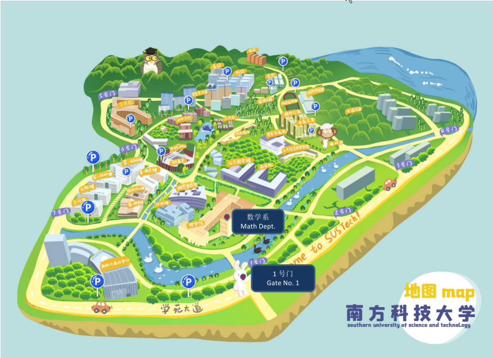

+++
title = "Logistics"
draft = false
MenutoUse = "conf2026"
customTitle = "Workshop on SPDEs and Mathematical Physics"
+++



## Direction {#direction}

Address: No. 1088 Xueyuan Road, Xili, Nanshan District, Shenzhen (深圳市南山区学苑大道 1088 号)

All talks will be held in the Department of Mathematics at the Southern University of Science and Technology. The department building is located near Gate No. 1.

## Accommodation {#accommodation}

Hotel rooms will be provided for all participants.

## Transportation {#transportation}

Participants may reach Shenzhen by air or high-speed rail.

### By Rail/高铁 {#by-rail-高铁}

Shenzhen North Railway Station (深圳北站) is situated approximately 4 km from the campus. Participants may either take a taxi or use Metro Line 5 to Tanglang Station (塘朗站), which is a five-minute walk from Gate No. 1.

### By Air/飞机 {#by-air-飞机}

Shenzhen Bao'an International Airport (深圳宝安机场) is approximately 50 minutes from the campus by car. Upon arrival, participants may take a taxi at Exit Gate 13 or use a ride-hailing service at Exit Gate 15 to reach the hotel or campus.

## Practical Information {#practical-information}

Shenzhen's weather in June is typically hot and humid, with average temperatures ranging from 26°C to 32°C.
