+++
title = "Scientific workflow in Emacs"
draft = false
showtoc = true
+++

> Vim is the editor God, and Emacs is God's editor.

I "live" in [Emacs](https://www.gnu.org/software/emacs/) everyday. I use it to

-   write LaTeX,
-   take notes,
-   read and annotate PDFs,
-   perform personal knowledge management ([Zettlekasten system](https://en.wikipedia.org/wiki/Zettelkasten)),
-   write codes (Python, Julia, ...),
-   build static sites (like this one),
-   read and send emails,
-   do GTD and time management,

and more.
For those who are looking for a more productive research workflow,
I hope that this article can be inspiring and introduce you to the Emacs's world of infinite possibilities.

## Life in Emacs {#life-in-emacs}

### LaTeX {#latex}

I started using Emacs as a LaTeX editor. One day I found myself capable of typing LaTeX fast enough to keep up with math lectures, and sine then, Emacs has been an indispensable part of my research workflow.

#### Overview {#overview}

The three packages AUCTeX, CDLaTeX and PDF-tools give Emacs the core functionality to write LaTeX.

-   The left part shows the LaTeX file and the right the compiled PDF (PDF-tools).
-   At startup, section contents are hidden to make it easier to navigate; you can unfold any section to start editing.
-   <kbd>C-c C-v</kbd> to jump from source to PDF (note the little red arrow and the highlighted text); double-click to jump from PDF to source.
-   Prettify: use Unicode symbols like `ℱ`, `∞` to show math macros like `\mathcal{F}`, `\infty`.
-   Fold LaTeX macros, so `\label{eq:XXX}`, `\cref{eq:XXX}` become `[l]`, `[cr]`.

I insert almost all macros using Emacs commands, so the invisible parts can stay error-free. See below.

#### Insert Macros Instantly {#insert-macros-instantly}

Use CDLaTeX to insert macros fast and accurately.

(Prettify is off in the screenshot.)

-   <kbd>\`+&lt;key&gt;</kbd> inserts Greek letters and symbols.
-   <kbd>&lt;keyword&gt;+TAB</kbd> expands to a macro or an environment template. Example:
    -   <kbd>equ*+TAB</kbd> inserts the `equation*` environment.
    -   <kbd>fr+TAB</kbd> expands to `\frac{}{}`.
-   <kbd>&lt;key&gt;+'</kbd> or <kbd>'+&lt;key&gt;</kbd> inserts modified letters. Example: <kbd>R'c</kbd> inserts `\mathcal{R}`.

All these shortcuts are highly customizable.

#### Cross Reference {#cross-reference}

A convenient cross-reference management brings the freedom of creating literate labels.

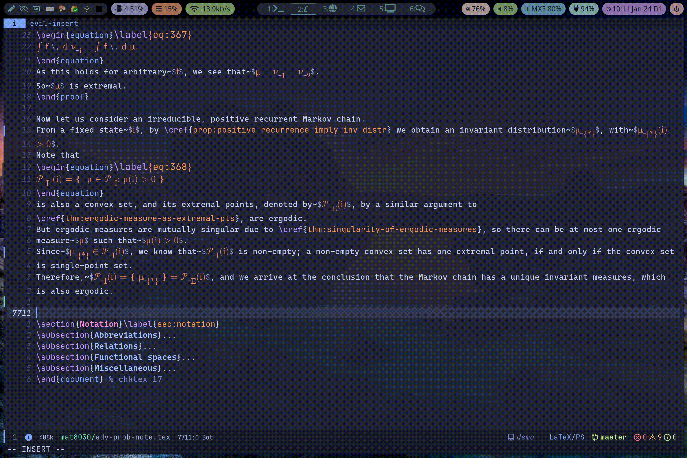

(TeX-fold is off in the screenshot.)
In the screenshot:

-   <kbd>ref+TAB</kbd> to start the RefTeX interface,
-   select the type `p` for "proposition",
-   navigate through all the `prop:` labels, view the context, and choose the correct label.

No more copy-and-paste.

### Note Taking and Knowledge Management {#note-taking-and-knowledge-management}

The traditional note is linear. I used to put all my notes in a single TeX, Org or Markdown file. But often as the note file  grew larger, it became harder to retrieve and analyze information. I also dreamed of integrating the reference manager [Zotero](https://www.zotero.org/) with Emacs, so I can connect the notes to the literature.

These were made possible by [Org-roam](https://www.orgroam.com/), a modern note system built upon Org mode in Emacs. During the COVID pandemic, a number of modern back-linked note systems (aka "person knowledge management" or "second brain") emerged, including [Roam Research](https://roamresearch.com/), [Obsedian](https://obsidian.md/), [Logseq](https://logseq.com/) and so on. Org-roam gets its name from Roam Research, which is the first such implementation.

#### What is PKM? {#what-is-pkm}

PKM (personal knowledge management) follows the principles of the [Zettlekasten system](https://en.wikipedia.org/wiki/Zettelkasten).
The first principle is to store knowledge inside a network of notes, rather than a traditional linear system.

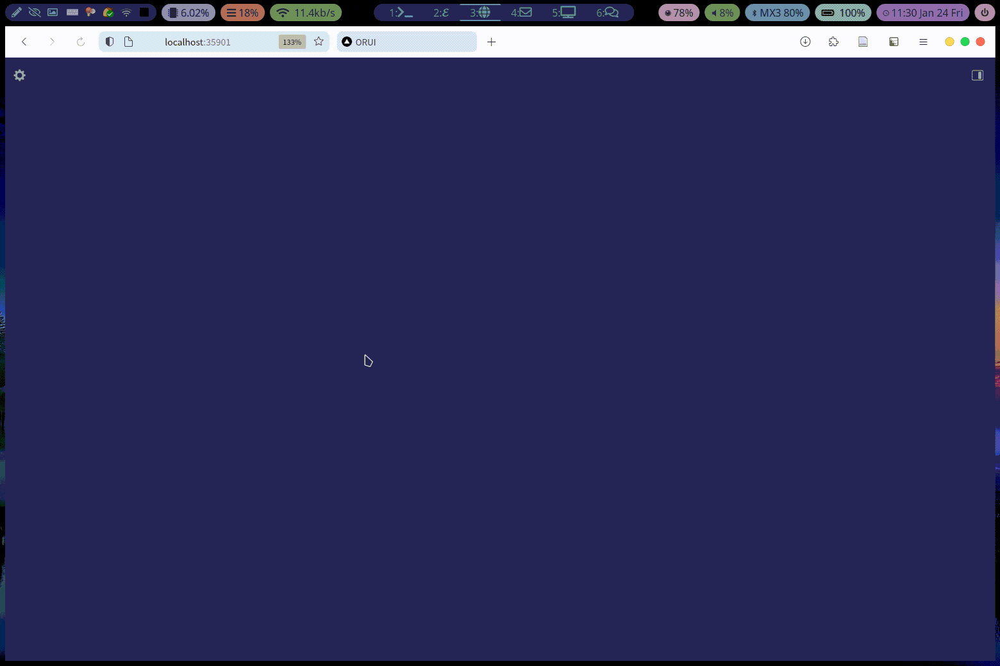

(My Org-roam notes in 2 years.)

Using the package ORUI, you can visualize the network of notes and preview the content.

#### Notes in Org {#notes-in-org}

I use `.org` files to store notes in Emacs. Org is a markup language like Markdown, and it has first class LaTeX support.

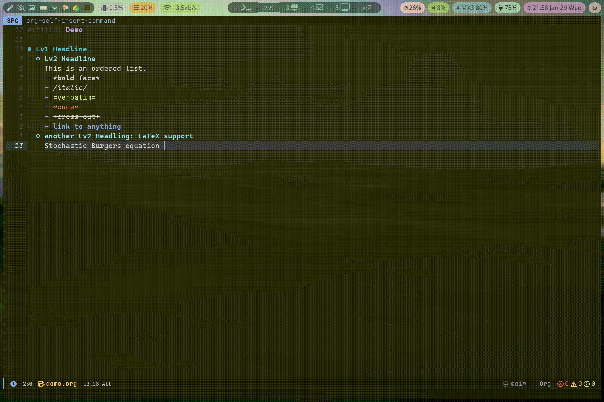

-   Use the built-in `org-cdlatex-mode` to enter math.
-   Preview the formula in place with `org-latex-preview`.

With a little more configuration, taking notes in Org mode is as good as in a TeX file, but more flexible and powerful. The Org mode can do A LOT in Emacs!

#### Create Links {#create-links}

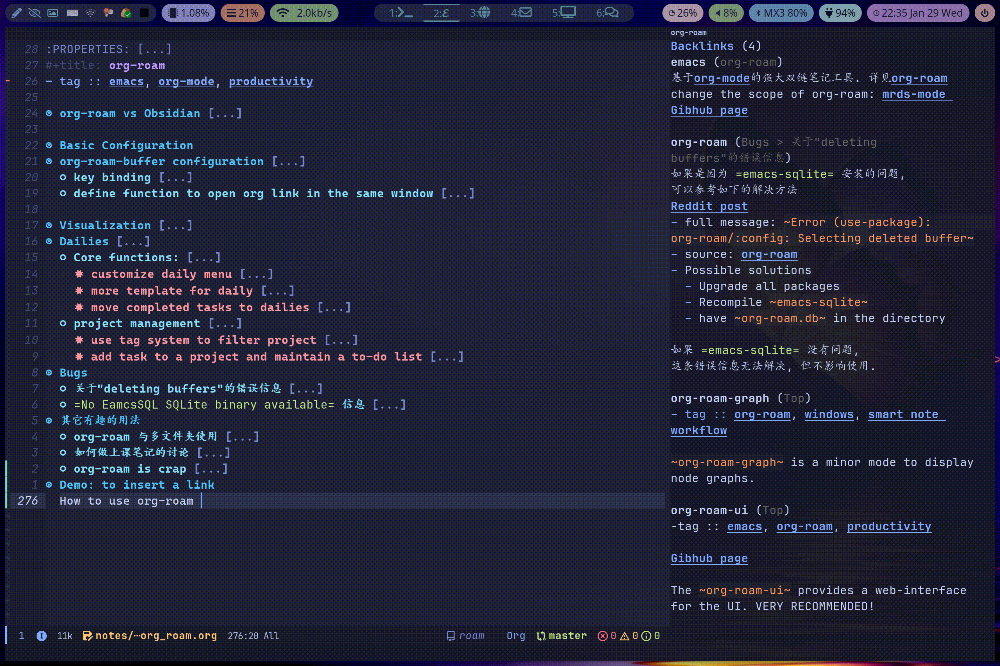

-   Use a completion interface to fuzzy search and insert a (forward) link.
-   The `org-roam-buffer` (on the right) keeps tracks of all the back-links and gives preview.

#### Why Emacs/Org-roam, not ... {#why-emacs-org-roam-not-dot-dot-dot}

Org roam has the following advantages over other note-taking applications.

-   All note files are text files, which are easy to sync and manage. If a better note system appears in Emacs in the future, the migration will also be simple.
-   For math notes, the LaTeX support is the best.
-   The note systems is as extensible and customizable as Emacs.
-   For the last 40 years Emacs has been evolving and adopting new technologies, and will keep doing so in the future. This is ideal for a life-long personal knowledge database. I am excited to see how AI becomes parts of Emacs.

### Reference Management {#reference-management}

I use Zotero to manage my references and full-text PDFs.
Zotero has a great PDF reader and good plugins on taking notes like [Better Notes](https://github.com/windingwind/zotero-better-notes).
But I prefer keeping all my notes in one place, that is, inside Org Roam.
Zotero helps me collect and store the reference, so Org Roam can integrate them into my second brain.

#### Take notes on PDFs {#take-notes-on-pdfs}

I use [Org Noter](https://github.com/weirdNox/org-noter) to make notes on PDF in Org files. Its key feature is syncing the headlines with their locations in the PDF.

An Org Noter session have two dedicated buffers:

-   a PDF-tools buffer (left) to display the PDF,
-   a Org buffer (right) to write notes.

#### Create notes from Zotero Metadata {#create-notes-from-zotero-metadata}

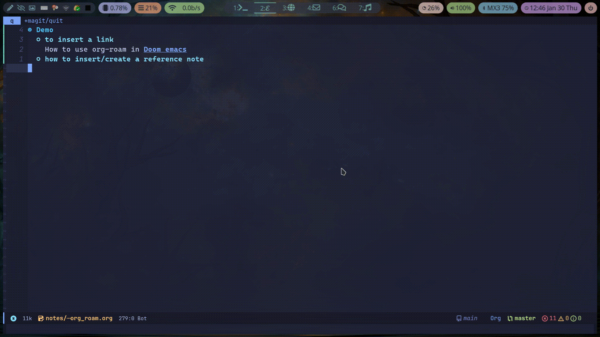

Workflow explained:

-   Zotero exports reference metadata to a `.bib` file,
-   Zotero stores PDFs in an external cloud drive like Nutstore (or any other ones)
-   Emacs reads the `.bib` file, so that
    -   it can search through the reference database,
    -   it can use the metadata to create Org files compatible with both Org Roam and Org Noter.

### Project Management {#emacs-project}

I use an Org Roam note for each of my research projects or other projects like "making an Emacs tutorial". The note acts as an entry point for the project, which contains two parts:

-   the note: written down ideas on the project, like drafts for paper or posts,
-   the TODO list: integration with GTD workflow in Org.

Below is an example.

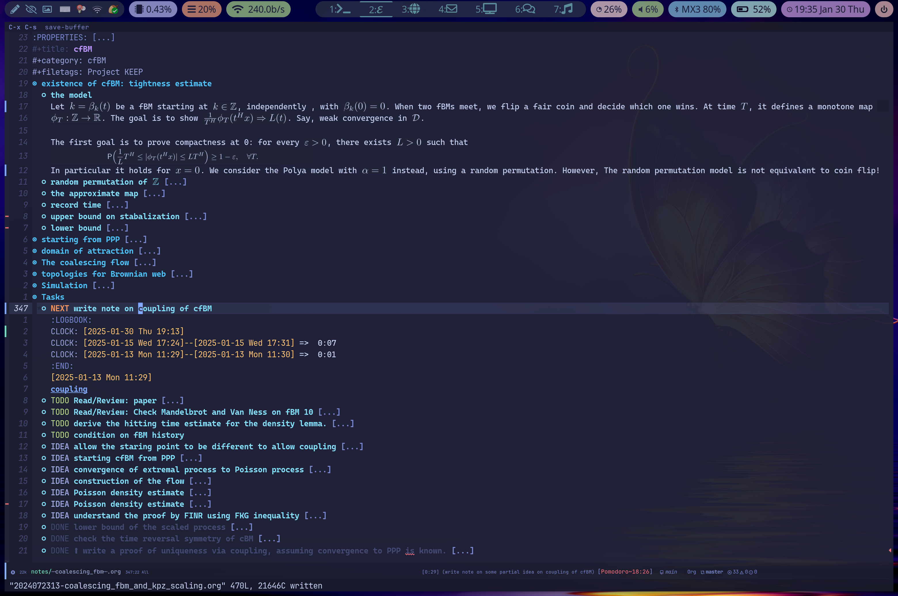

#### Project Note {#project-note}

The main part is like a normal note but much longer. For a research project, I treat it as a draft of paper that consists of concrete definitions, theorems, proofs and so on. I can use the Org export feature to turn it to a true LaTeX file whenever I feel ready and want to have finer control on the output.

The advantage of having a project note sitting in the second brain is to connect with other notes.
Most links fall into the following three categories.

-   Other ordinary notes containing concepts, results related to the project. These include reference notes.
-   A piece of argument which I expect to be useful in other context, like a nice small lemma or an estimate. I will create another note for it and link to it.
-   Some premature ideas that may or may not work. I keep them in "Org dailies" and they are referencing the project note like a tag. These parts in the dailies are like a digital archive of the scrap paper. When I am running out of ideas I can browse through them via the back-links.

#### Project TODO List {#emacs-research-todo}

I keep a TODO list of the project following the last headline name "Task".
These tasks will appear in my Org Agenda View (see [View tasks in Agenda View](#emacs-agenda)).

Random ideas can pop out when I am working on a problem.
I use the Org Capture function to record them so that I can revisit them later (see [Create Tasks](#emacs-org-capture)).
They are the headlines with the `IDEA` keywords (see [The TODO keywords](#emacs-todo-keywords)).
If I decide to work on any of them later, I will turn it into a `TODO` item.

### Agenda and GTD {#agenda-and-gtd}

I use the GTD workflow for my research and other projects. A TODO item is an Org headline with `todo-keyword` like `TODO` at the beginning.

#### Create Tasks {#emacs-org-capture}

An important step in GTD is to divide a big task into manageable small tasks.
I use Org capture for this.

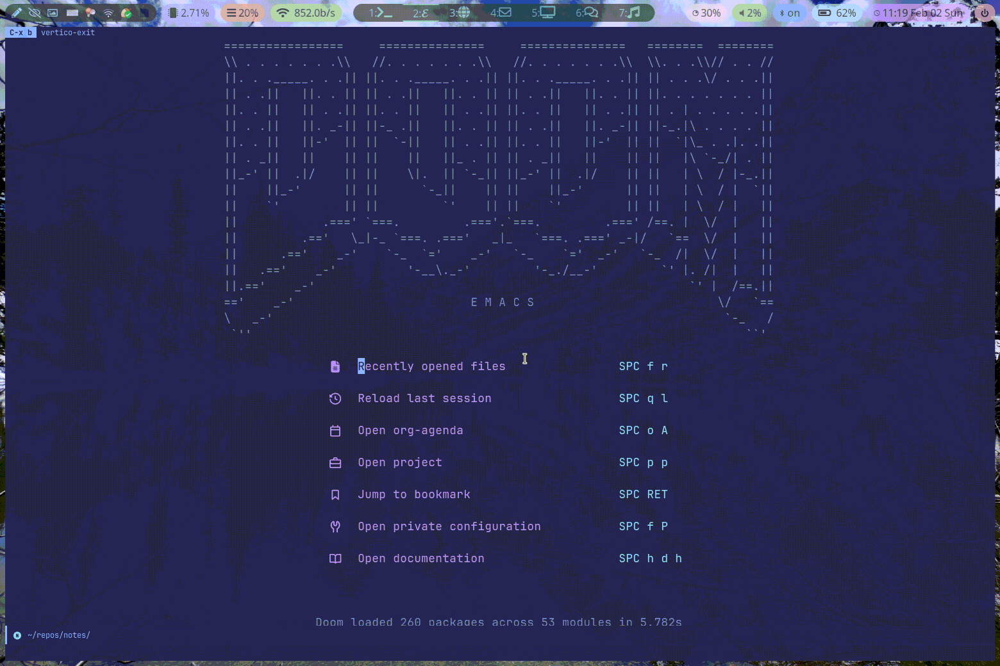

You can customize the Org capture templates for different types of tasks.

#### View tasks in Agenda View {#emacs-agenda}

The Org Agenda View gathers TODO items from a set of files (including my project notes, see [Project Management](#emacs-project)).
You can organize and sort all your TODO items according to priority, tags, deadlines and so on.

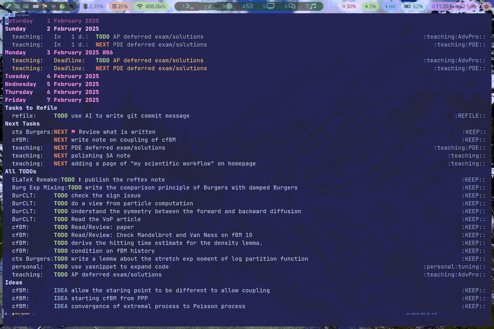

The Agenda View is highly customizable like anything else in Emacs.
I design my agenda view so that the tasks that I should pick will appear near the top.

-   The first part consists of deadlines due in one week. Most of them are teaching related like "prepare lecture notes", "prepare exam problems".
-   "Task to Refile": newly captured tasks waiting for classification.
-   The other sections are tasks with `NEXT`, `TODO` and `IDEA` keywords, see [The TODO keywords](#emacs-todo-keywords) for more explanation. Within each section I sort the tasks according to their priorities.

<!--list-separator-->

-  The TODO keywords

    The default keywords are `TODO` and `DONE`, which are self-explanatory.
    Depending on your workflow you can customize it, but it is better to keep it simple. I use the following.

    -   `NEXT`: a task in progress, which will appear near the top of my agenda view.
    -   `IDEA`: I use this keyword for valuable ideas worth pursuing in research projects (see [Project TODO List](#emacs-research-todo)), or immature projects.
    -   `HOLD`: tasks paused for some reasons.

#### Clocking {#clocking}

I use the Org mode to clock how much time I spend on tasks. When I finish a task, a clock summary is created and the task is archived to a daily note.

#### Pomodoro Method {#pomodoro-method}

With [Org Pomodoro](https://github.com/marcinkoziej/org-pomodoro), you can adopt the pomodoro method together with the clock in/out feature.
In the screenshot in [Project Management](#emacs-project), you can find the pomodoro timer in the modeline.

### Other Tasks {#other-tasks}

#### Seminar Notes {#seminar-notes}

I use a special template for notes taken during a seminar. See the example below.

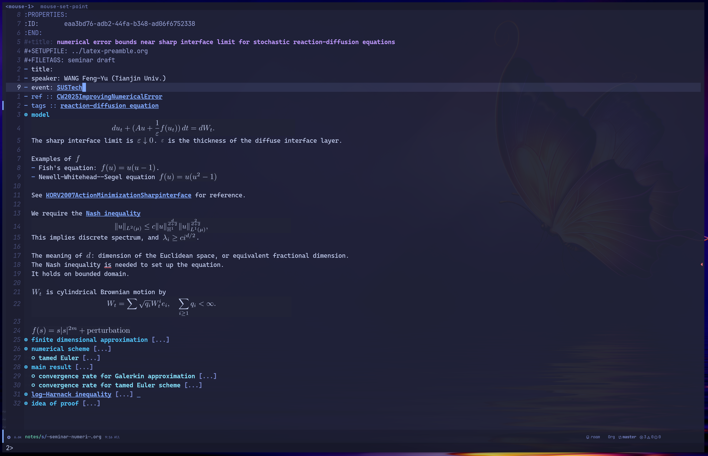

-   Other than the metadata, this is a normal Org Roam note.
-   The template include two extra file tags, which are useful in searching notes.
    -   `seminar`: this tag is self-explanatory.
    -   `draft`: I will keep this tag until I have reviewed the note (spell checking, adding links)
-   Links to two types of notes are visible in the screenshot.
    -   reference notes: links of the format `ABC20XXSomeTitleWords`. The text is from the BibTeX citation key.
    -   normal notes: all other links.
    -   adding links is an important step in the Zettlekasten workflow, because only processed information has value in the note system.

#### Email Client {#email-client}

I read and write emails in Emacs, using the package mu4e.

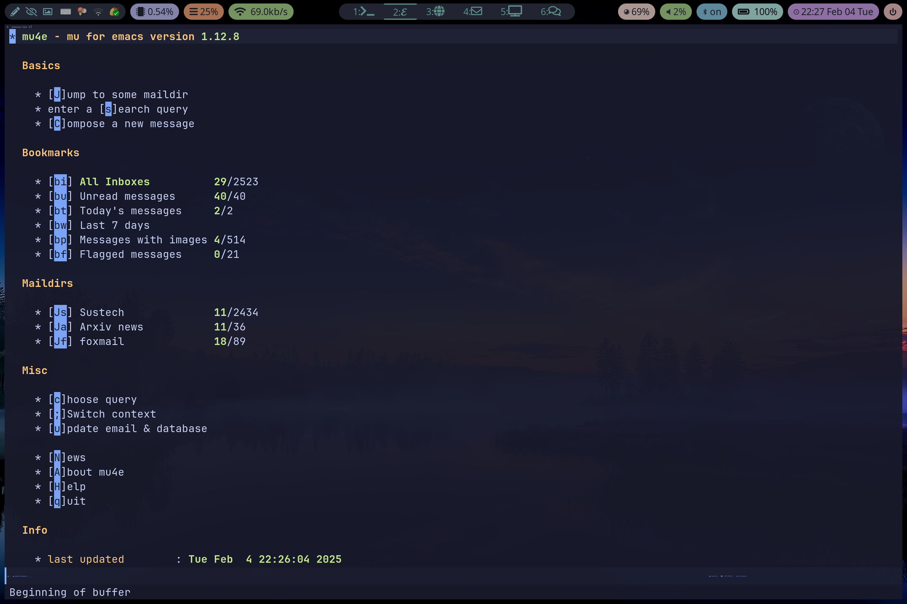
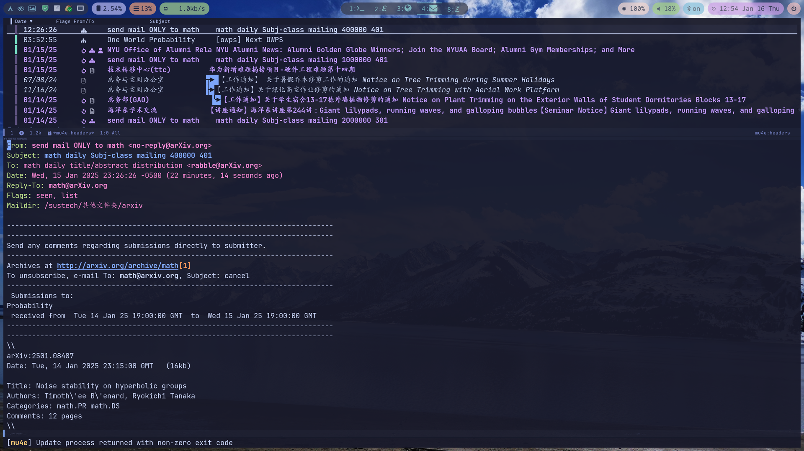

#### Build Static Sites {#build-static-sites}

This whole homepage is in an Org file, exported to [Hugo](https://gohugo.io/) Markdown files by the `ox-hugo`.

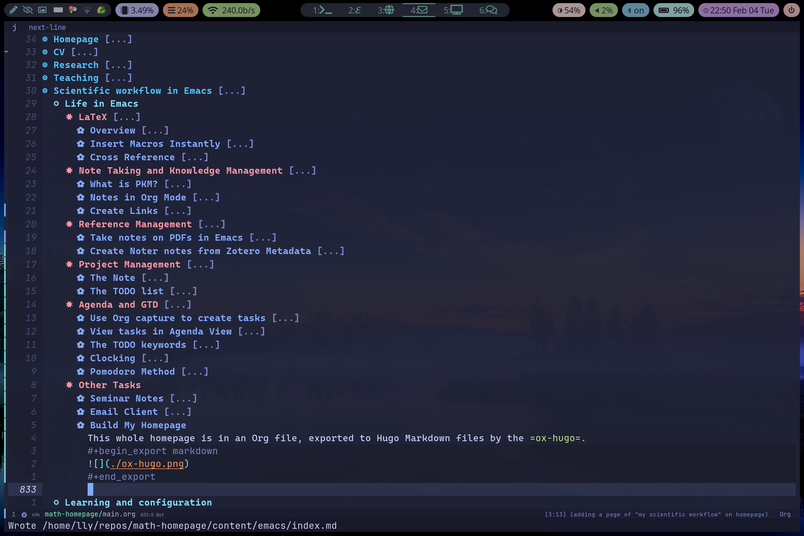

#### Git Client {#git-client}

With [magit](https://magit.vc), Emacs becomes one of the best Git clients.

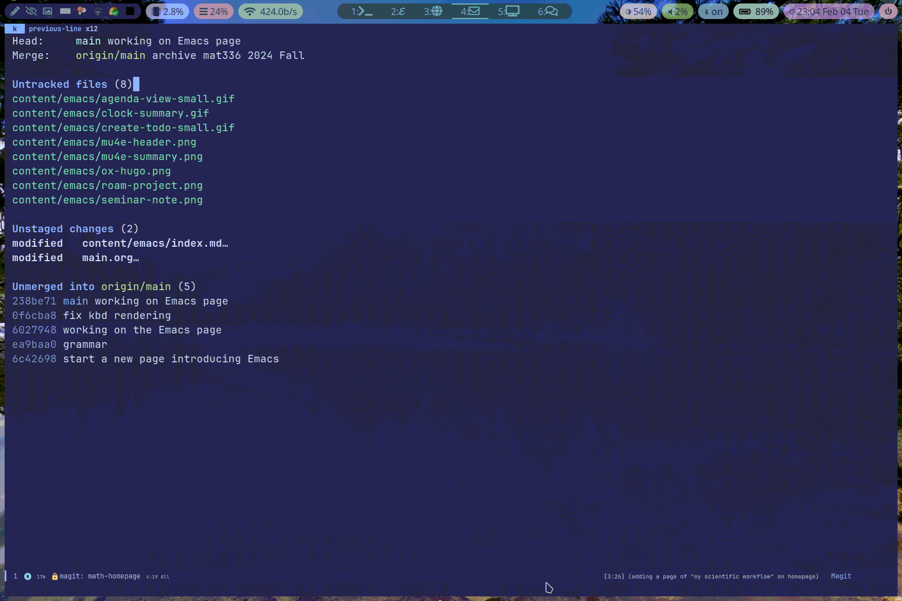

## Learning and configuration {#learning-and-configuration}

### Installation {#installation}

Emacs is available on all systems.

-   Linux: Fastest.
-   Windows: available as a binary (`.exe`) or through WSL2.
    -   binary: I recommend installation via [msys2](https://www.msys2.org/), so that you can also install other dependencies conveniently with the package manager.
    -   WSL2: GUI is now supported thanks to WSLg; almost like Linux except a little slower.
-   macOS: available via [Homebrew](https://brew.sh/) (I never use macOS myself).
-   Android: I use it for a while on my Android tablet to take seminar notes; it is slower than a laptop due to the processor. The tricky part is to have Emacs and Termux work together; you can find more details [here](https://sourceforge.net/projects/android-ports-for-gnu-emacs/files/termux/) to have a try.

You can find more installation related guides on the [official site](https://www.gnu.org/savannah-checkouts/gnu/emacs/emacs.html). The Doom Emacs also provides a good [guide](https://github.com/doomemacs/doomemacs/blob/master/docs/getting_started.org#emacs--dependencies).

### Learning {#learning}

Emacs is well-known for the steep learning curve, but being parts of a lift-long project compensates this.
Below are two introductory series of videos tutorials on Bilibili (in Chinese) that might be helpful.

-   [LaTeX and Emacs](https://space.bilibili.com/314984514/lists/1218873)
-   [Org Roam and PKM](https://space.bilibili.com/314984514/lists/1292182)

### My Configuration {#my-configuration}

I am using [Doom Emacs](https://github.com/doomemacs/doomemacs). You can find my configuration [here](https://github.com/liyingli-math/doom-emacs-config).
