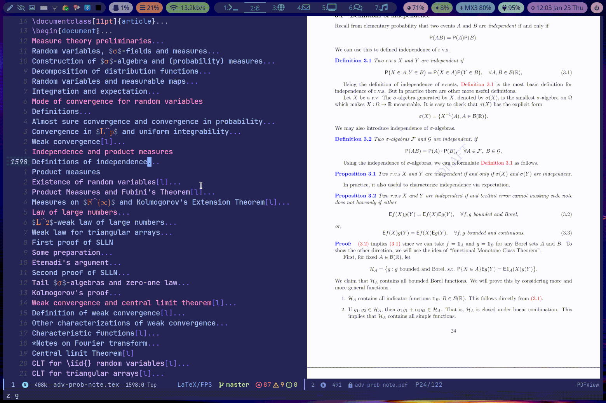

+++
title = "Scientific workflow in Emacs"
draft = false
showtoc = true
+++

> Vim is the editor God, and Emacs is God's editor.

I "live" in [Emacs](https://www.gnu.org/software/emacs/) everyday. I use it to

-   write LaTeX,
-   take notes,
-   read and annotate PDFs,
-   perform personal knowledge management ([Zettlekasten system](https://en.wikipedia.org/wiki/Zettelkasten)),
-   write codes (Python, Julia, ...),
-   build static sites (like this one),
-   read and send emails,
-   do GTD and time management,

and more.
For those who are looking for a more productive research workflow,
I hope that this article can be inspiring and introduce you to the Emacs's world of infinite possibilities.

## Life in Emacs {#life-in-emacs}

### LaTeX {#latex}

I started using Emacs as a LaTeX editor at college. After some time I realized that, I could write LaTeX in Emacs fast enough to keep up with math lectures.

From then on, Emacs became an indispensable part of my research workflow.

#### Overview {#overview}

The AUCTeX package provides the basic functionality for LaTeX editing in Emacs.

When working on a LaTeX file, I split the frame into two windows: the left one shows the file and the right the compiled PDF (PDF-tools).

At startup, section contents are invisible (Outline Mode); I can navigate to the (sub)section that I want to edit and expand it.

Forward search and inverse search are available: in the GIF I use the keybinding <kbd>C-c C-v</kbd> to jump from the LaTeX buffer to the PDF and sync the location (note the little red arrow and the highlight in the text); double-clicks on the PDF will activate the backward search.

I try to show minimal LaTeX syntax while editing.
For example, the `prettify-symbols-mode` will show a Unicode letter `ℱ` in place of `\mathcal{F}`

## Learning and configuration {#learning-and-configuration}

Test
